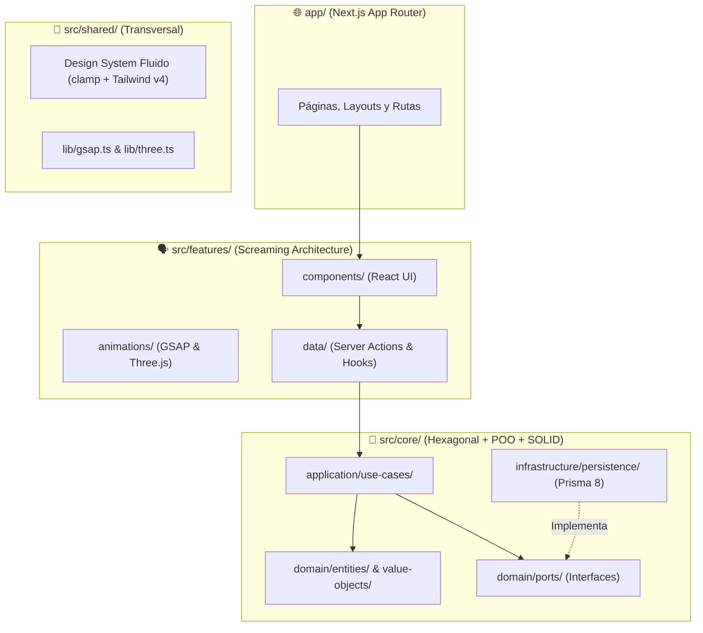

# 🏛️ Arquitectura de Software — Match Fútbol

Este documento detalla los principios arquitectónicos, patrones de diseño y estándares técnicos implementados en **Match Fútbol**.

---

## 1. Visión General: Híbrido Empresarial (`core` + `features` + `shared`)

El sistema combina **Arquitectura Hexagonal (Ports & Adapters)** para la lógica de negocio con **Screaming Architecture** para las funcionalidades de producto:

---

## 2. El Motor de Negocio (`src/core/`)

`src/core/` es **100% agnóstico del framework visual (React/Next.js)**. Está escrito en TypeScript puro aplicando **Programación Orientada a Objetos (POO)**, **Domain-Driven Design (DDD)** y los 5 principios **SOLID**.

### Capas Internas de cada Módulo (`profiles`, `matches`, `applications`, `chat`):

1. **`domain/` (Núcleo Puro - Cero dependencias externas):**
   * **`entities/`:** Clases con identidad única (`id`) que encapsulan estado y comportamiento de negocio (ej. `Match.occupySlot()` descuenta un cupo y transiciona automáticamente a `FULL` cuando llega a `0`).
   * **`value-objects/`:** Clases inmutables (`Object.freeze`) que se autovalidan al instanciarse:
     * `Alias`: Valida formato y longitud (3 a 24 caracteres).
     * `PhoneNumber`: Valida formato y encapsula la regla de privacidad `.reveal(isAuthorized)`.
     * `MatchSlots`: Valida cupos máximos según la modalidad (`FUTBOL_5`, `FUTBOL_7`, `FUTBOL_8`, `FUTBOL_11`).
     * `MatchDate`: Impide programar partidos nuevos en fechas pasadas.
     * `ApplicationMessage` y `MessageContent`: Validan longitudes y contenido.
   * **`errors/`:** Jerarquía de errores que heredan de `DomainError`.
   * **`ports/`:** Contratos segregados en interfaces de lectura (`I*Reader`) y escritura (`I*Writer`).

2. **`application/` (Orquestación de Casos de Uso):**
   * **`use-cases/`:** Clases con una única responsabilidad (`Execute`) que reciben sus puertos por inyección de dependencias en el constructor.
   * **`dtos/`:** Contratos tipados de entrada y salida.

3. **`infrastructure/` (Adaptadores Secundarios):**
   * **`persistence/`:** Implementaciones reales con **Prisma 8** (`@prisma/orm-postgres`) contra **Supabase PostgreSQL**.
   * **`mappers/`:** Clases encargadas de traducir entre registros crudos de base de datos, entidades POO de dominio y DTOs.

---

## 3. Aplicación de Principios SOLID

| Principio | Implementación en Match Fútbol |
| :--- | :--- |
| **S — Single Responsibility** | Cada Caso de Uso (`CreateMatchUseCase`, `ResolveApplicationUseCase`) ejecuta una sola acción de negocio; los `Mappers` solo transforman datos; las `Entities` solo validan invariantes. |
| **O — Open/Closed** | Los Value Objects y Entidades permiten extender modalidades y reglas sin modificar los orquestadores de aplicación. |
| **L — Liskov Substitution** | Los Casos de Uso funcionan de forma idéntica tanto con `Prisma*Repository` (producción) como con `InMemory*Repository` (tests unitarios en Vitest). |
| **I — Interface Segregation** | Puertos divididos en `Reader` (consultas) y `Writer` (mutaciones): `IMatchReader` vs `IMatchWriter`. |
| **D — Dependency Inversion** | Los Casos de Uso dependen exclusivamente de las interfaces en `domain/ports/`, nunca del cliente de Prisma o Supabase. |

---

## 4. Capa de Producto (`src/features/`) — Screaming Architecture

Cada funcionalidad de cara al jugador vive aislada en su propio módulo dentro de `src/features/<modulo>/`:
* **`components/`:** Componentes visuales específicos de esa funcionalidad.
* **`data/`:** Server Actions, hooks y llamadas a los Casos de Uso de `@/core/*`.
* **`types/`:** Tipos de vista y formularios.
* **`animations/`:** Coreografías específicas con **GSAP** y escenas **Three.js**.

---

## 5. Design System Fluido y Tipografía (`app/globals.css`)

* **Sistema Tipográfico Dual Exclusivo:**
  1. **Messi Font (`--font-messi`):** Tipografía principal del cuerpo, dorsales, marcadores e interfaz deportiva.
  2. **DM Serif Display (`--font-serif-display`):** Tipografía exclusiva para títulos de alto impacto (`h1`, `h2`, `h3`).
* **Escalas Fluidas con `clamp()`:**
  * Tipografía fluida (`--text-fluid-sm`, `--text-fluid-lg`, `--text-fluid-xl`, `--text-fluid-2xl`, `--text-fluid-hero`).
  * Espaciados fluidos (`--spacing-fluid-card`, `--spacing-fluid-container`, `--spacing-fluid-section`, `--spacing-fluid-grid`).
* **CSS Reset con `:where()` en `@layer base`:**
  * Especificidad cero (`0,0,0`) integrada en la capa base de Tailwind CSS v4, garantizando limpieza entre navegadores, soporte de accesibilidad (`prefers-reduced-motion`, `prefers-contrast`) y prioridad total para las utilidades de Tailwind.

---

## 6. Calidad de Código y Testing

* **Linter Ultrarrápido en Rust:** **Oxlint** (`.oxlintrc.json`), ejecutando más de 160 reglas sobre todo el proyecto en ~25ms.
* **Tests Unitarios de Dominio y Aplicación:** **Vitest** (`vitest.config.ts`), probando entidades POO, Value Objects y Casos de Uso con repositorios en memoria (`src/core/**/__tests__/*.test.ts`).
